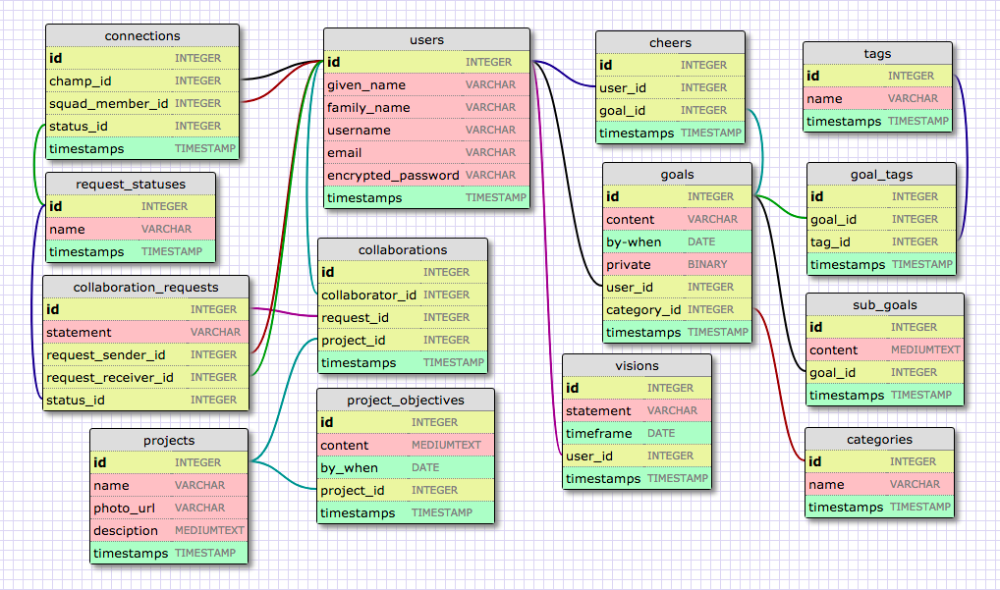

# SquadGoals

## Built With

### Back End

- [Ruby on Rails](http://guides.rubyonrails.org/)
- [PostgreSQL](https://www.postgresql.org/) - Database
- [Paperclip](https://github.com/thoughtbot/paperclip) - Image attachment
- [AWS](https://aws.amazon.com/) - Image storing
- [CircleCI](https://circleci.com/) - Testing
- [Heroku](https://www.heroku.com/) - Deployment

### Front End

- HTML5
- CSS
- JavaScript
- jQuery

## Authors

- Austin Ratcliff - [austinratcliff](https://github.com/austinratcliff)
- Patrick Rodriguez - [patrodriguez108](https://github.com/patrodriguez108)
- Kristin MacDonough - [kmac02](https://github.com/kmac02)

## Schema

## User Stories

- As a guest, I want land on the home page so I can see a list of public goals.
- As a new user, I want to register so that I can set a vision and a first goal.
- As a user, I want to visit the page and browse goals by tags.
- As a current user, I want to log in to see my profile page so I can review my vision and list of goals.
- As a current user, I want to make new goals so I work towards fulfilling my vision.
- As a current user making a new goal, I want to determine if the goal is private or public.
- As a current user, I want to log in and select one of my goals so I can view details about that goal.
- As a current user making a goal, I want to add tags to my goal so that I may connect with other users who have similar goals
	- As a current user, I want to be able to inform another user that I support their goal
- As a current user, I want to connect with other users that have a similar goal
	- I want to send a request to another user to connect
	- If my request is accepted, I want my progress to be displayed on the profile of the user who accepted
- As a user I may receive a request to connect
	- I want to have the choice to accept or decline that request
	- If I accept the request, I want the progress of the user who requested to connect to appear on my profile
- As a current user, I want to collaborate with other users that have a similar goal
	- I want to request another user to collaborate on a project by proposing a project idea
	- If my request is accepted, I want to be able to access this project from my profile
	- If my request is accepted, I want to be able to modify and add to the project page along with the user I am collaborating with
- As a user I may receive a request to collaborate on a project with another user
	- I want to have the choice to accept or decline that request
	- If I accept the request, I want to be brought straight to the creation of this project.
	- If I accept the request, I want to be able to access this project from my profile
	- If I accept the request, I want to be able to modify and add to the project page along with the user I am collaborating with

## License

This project is licensed under the MIT License

## Acknowledgements

Thank you to [Graham](https://github.com/telegraham) and [Duke](https://github.com/dukegreene) for all the help and guidance on this project.